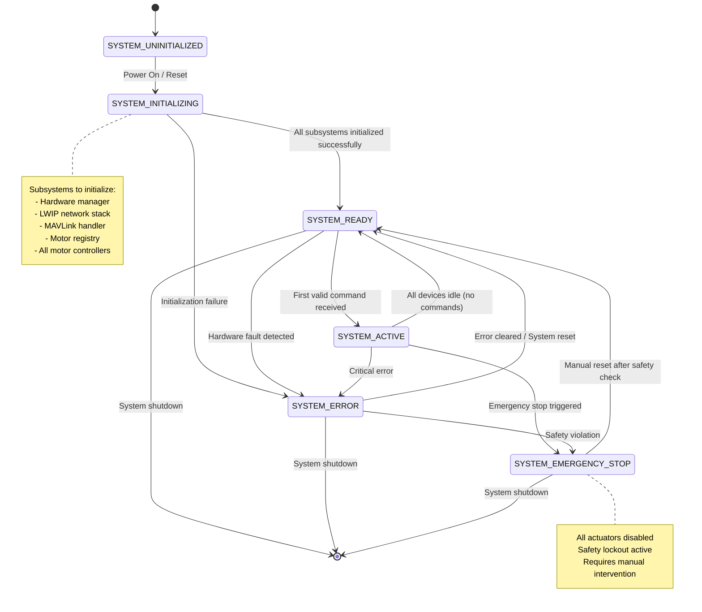
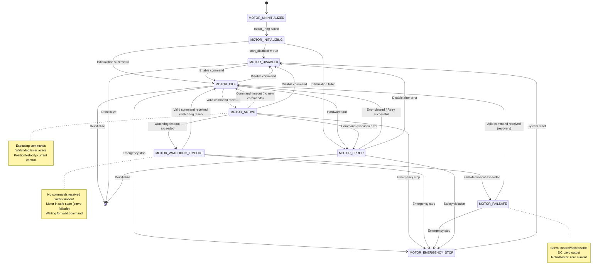
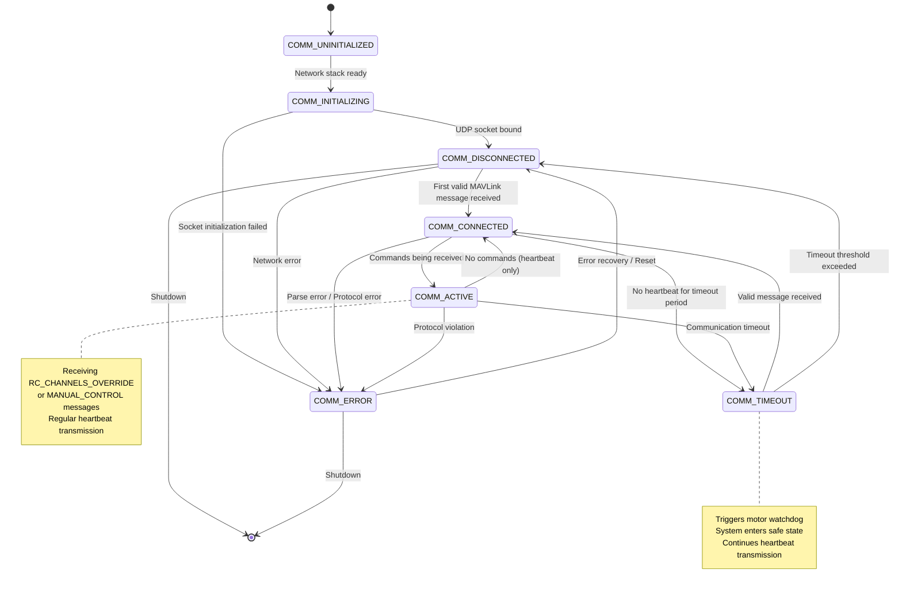
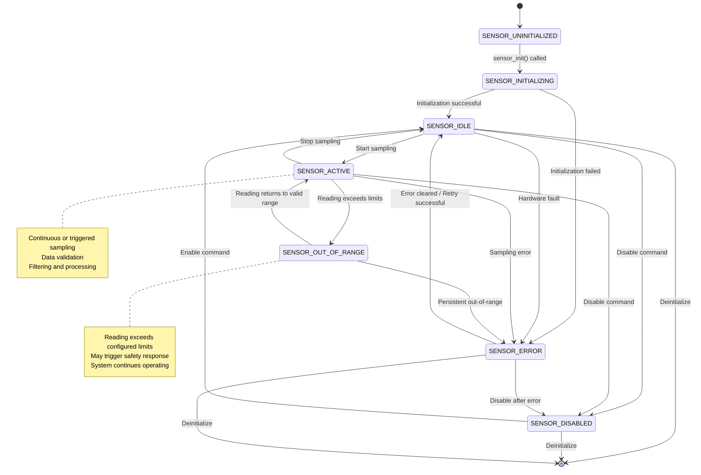
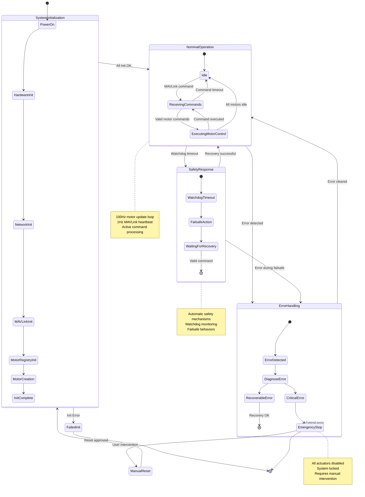

# Unified State Management System
## State Diagram for Actuators and Sensors

This document defines the unified state management architecture for all actuators (motors) and sensors in the STM32H753 system.

---

## System-Level State Machine



---

## Motor/Actuator State Machine



---

## Communication State Machine (MAVLink)



---

## Sensor State Machine (Future Extension)



---

## Integrated System State Flow



---

## State Transition Table

### System States

| Current State | Event | Next State | Actions |
|---------------|-------|------------|---------|
| UNINITIALIZED | Power On | INITIALIZING | Begin initialization sequence |
| INITIALIZING | Init Success | READY | Enable subsystems |
| INITIALIZING | Init Failure | ERROR | Log error, set error flags |
| READY | First Command | ACTIVE | Begin command processing |
| ACTIVE | All Idle | READY | Continue monitoring |
| ACTIVE | Critical Error | ERROR | Disable affected systems |
| ACTIVE | Emergency Stop | EMERGENCY_STOP | Disable all actuators |
| ERROR | Error Cleared | READY | Re-enable systems |
| EMERGENCY_STOP | Manual Reset | READY | Require safety verification |

### Motor States

| Current State | Event | Next State | Actions |
|---------------|-------|------------|---------|
| UNINITIALIZED | Init Called | INITIALIZING | Configure hardware |
| INITIALIZING | Init OK (enabled) | IDLE | Ready for commands |
| INITIALIZING | Init OK (disabled) | DISABLED | Await enable command |
| INITIALIZING | Init Failed | ERROR | Log error code |
| IDLE | Valid Command | ACTIVE | Execute command, start watchdog |
| ACTIVE | Command Timeout | IDLE | Stop motion, clear watchdog |
| ACTIVE | Watchdog Timeout | WATCHDOG_TIMEOUT | Enter safe state |
| WATCHDOG_TIMEOUT | Timeout Exceeded | FAILSAFE | Apply failsafe behavior |
| ACTIVE | Disable Command | DISABLED | Stop motion, disable output |
| ERROR | Error Cleared | IDLE | Reset error flags |
| * | Emergency Stop | EMERGENCY_STOP | Immediate disable |

### Communication States

| Current State | Event | Next State | Actions |
|---------------|-------|------------|---------|
| UNINITIALIZED | Network Ready | INITIALIZING | Create UDP socket |
| INITIALIZING | Socket Bound | DISCONNECTED | Begin listening |
| DISCONNECTED | First Message | CONNECTED | Start heartbeat timer |
| CONNECTED | Commands Received | ACTIVE | Route to motor registry |
| ACTIVE | Command Timeout | CONNECTED | Continue heartbeat |
| CONNECTED | Comm Timeout | TIMEOUT | Trigger motor watchdogs |
| TIMEOUT | Message Received | CONNECTED | Resume normal operation |
| * | Protocol Error | ERROR | Log error, attempt recovery |

---

## Implementation Guidelines

### State Data Structure

```c
// System-level state
typedef enum {
    SYSTEM_UNINITIALIZED = 0,
    SYSTEM_INITIALIZING,
    SYSTEM_READY,
    SYSTEM_ACTIVE,
    SYSTEM_ERROR,
    SYSTEM_EMERGENCY_STOP
} system_state_t;

// Motor/Actuator state
typedef enum {
    MOTOR_UNINITIALIZED = 0,
    MOTOR_INITIALIZING,
    MOTOR_IDLE,
    MOTOR_ACTIVE,
    MOTOR_WATCHDOG_TIMEOUT,
    MOTOR_FAILSAFE,
    MOTOR_ERROR,
    MOTOR_DISABLED,
    MOTOR_EMERGENCY_STOP
} motor_state_t;

// Communication state
typedef enum {
    COMM_UNINITIALIZED = 0,
    COMM_INITIALIZING,
    COMM_DISCONNECTED,
    COMM_CONNECTED,
    COMM_ACTIVE,
    COMM_TIMEOUT,
    COMM_ERROR
} comm_state_t;

// Sensor state (future)
typedef enum {
    SENSOR_UNINITIALIZED = 0,
    SENSOR_INITIALIZING,
    SENSOR_IDLE,
    SENSOR_ACTIVE,
    SENSOR_OUT_OF_RANGE,
    SENSOR_ERROR,
    SENSOR_DISABLED
} sensor_state_t;
```

### State Transition Functions

```c
// System state management
error_code_t system_set_state(system_state_t new_state);
system_state_t system_get_state(void);
bool system_can_transition(system_state_t from, system_state_t to);

// Motor state management (per motor)
error_code_t motor_set_state(uint8_t motor_id, motor_state_t new_state);
motor_state_t motor_get_state(uint8_t motor_id);
bool motor_can_transition(motor_state_t from, motor_state_t to);

// Communication state management
error_code_t comm_set_state(comm_state_t new_state);
comm_state_t comm_get_state(void);

// State transition callbacks
typedef void (*state_transition_callback_t)(void* context, int prev_state, int new_state);
error_code_t register_state_callback(state_transition_callback_t callback);
```

### State Persistence

```c
// State history for debugging
typedef struct {
    uint32_t timestamp;
    uint8_t device_id;
    uint8_t prev_state;
    uint8_t new_state;
    error_code_t reason;
} state_transition_log_t;

#define STATE_LOG_SIZE 64
extern state_transition_log_t state_log[STATE_LOG_SIZE];
extern uint32_t state_log_index;
```

---

## Key Design Principles

1. **Explicit State Transitions**: All state changes must be explicit and logged
2. **Error Recovery**: Every error state has a defined recovery path
3. **Safety First**: Emergency stop can be triggered from any state
4. **Watchdog Protection**: Active motors have mandatory watchdog timers
5. **Graceful Degradation**: Individual motor failures don't crash the system
6. **State Validation**: Illegal transitions are rejected with error codes
7. **Observable States**: All states can be queried via MAVLink parameter protocol
8. **Deterministic Behavior**: Same input + same state = same output
9. **Hierarchical States**: System state constrains motor states
10. **Timeout Handling**: All timeout conditions have defined behavior

---

## Integration with Existing Code

### Current Implementation Gaps

1. **No explicit system state tracking** - Currently implicit in `motors_initialized` flag
2. **Motor states not formalized** - Motor state exists but not unified
3. **Communication state not tracked** - MAVLink connection status not monitored
4. **No state transition validation** - Transitions happen without checking legality
5. **Limited state observability** - Cannot query device states via MAVLink

### Recommended Implementation Steps

1. Add state enums to `App/config/motor_config.h`
2. Add state fields to motor controller structures
3. Implement state transition functions in `motor_interface.h/c`
4. Add state logging to `hardware_manager.c`
5. Expose state via MAVLink PARAM_VALUE messages
6. Add state validation to command handlers in `freertos.c`
7. Implement state machine unit tests

---

## MAVLink State Reporting

### Proposed Parameters for State Monitoring

```
PARAM: SYS_STATE         - System state (0-5)
PARAM: COMM_STATE        - Communication state (0-6)
PARAM: MOTOR1_STATE      - Motor 1 state (0-8)
PARAM: MOTOR2_STATE      - Motor 2 state (0-8)
...
PARAM: MOTOR8_STATE      - Motor 8 state (0-8)
PARAM: EMERGENCY_ACTIVE  - Emergency stop active (0/1)
```

### State Change Events

Consider implementing STATUSTEXT messages for important state transitions:
- System entering EMERGENCY_STOP
- Motor entering ERROR state
- Communication TIMEOUT detected
- System READY after initialization
